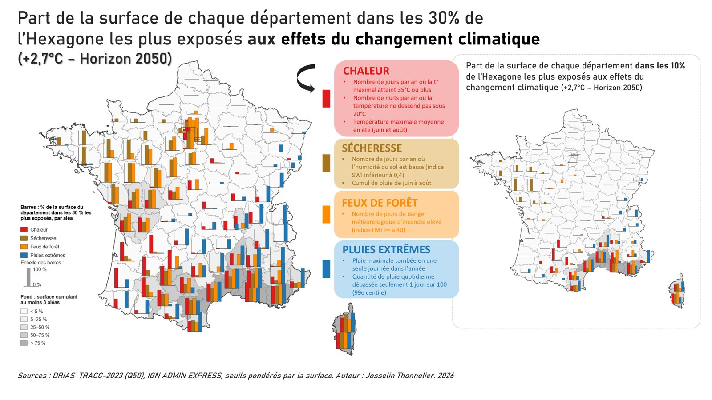

# Climat 2050 : quels seront les aléas climatiques dominants sur votre territoire ?

Chaleur, sécheresse, feux de forêt, pluies extrêmes : quels départements et quelles intercommunalités de l'Hexagone seront les plus exposés dans une France à **+2,7 °C (2050)** et **+4 °C (2100)** ?

**➡ Carte interactive : https://geopi-conseil.github.io/climat-2050-france/**



## Ce que montre la carte

Pour chaque département et chaque EPCI, quatre barres indiquent la **part de la surface du territoire** au-dessus d'un seuil d'exposition (**10 %** ou **30 %**), aléa par aléa. Le fond gris indique la part de la surface qui **cumule au moins trois aléas**.

La carte propose **deux modes de lecture** :

| Mode | Seuil utilisé | Question à laquelle il répond |
|---|---|---|
| **Basculement** (par défaut) | niveau atteint en **1976-2005** par les 10 % (ou 30 %) du territoire les plus exposés, appliqué tel quel en 2050 et 2100 | Quelle part de mon territoire bascule dans des conditions qui étaient, hier, celles des zones les plus exposées ? Les zones s'étendent avec le réchauffement. |
| **Classement** | 10 % (ou 30 %) du territoire les plus exposés **à chaque horizon** | Quels territoires seront, demain, les plus exposés par rapport aux autres ? La surface concernée reste constante par construction. |

| Aléa | Variables DRIAS (TRACC-2023) |
|---|---|
| Chaleur | jours avec Tx ≥ 35 °C · nuits tropicales (Tn ≥ 20 °C) · température maximale moyenne en été |
| Sécheresse | jours de sol sec (SWI < 0,4) · cumul de pluie de juin à août (inversé) |
| Feux de forêt | jours avec Indice Forêt Météo (IFM) ≥ 40 |
| Pluies extrêmes | pluie maximale en une journée · 99ᵉ centile des pluies quotidiennes |

## Méthode (résumé)

1. **Données** : DRIAS / Météo-France, « Quantiles des indicateurs annuels TRACC-2023 moyennés par niveau de réchauffement », médiane (Q50) de l'ensemble des simulations, grille SAFRAN 8 km (8 981 mailles) ; niveaux : référence 1976-2005, France +2 °C, +2,7 °C et +4 °C.
2. **Mailles → communes** : moyenne des mailles pondérée par la surface d'intersection (34 748 communes, IGN ADMIN EXPRESS COG CARTO).
3. **Notes 0-100** : chaque variable est normalisée entre ses percentiles 2 et 98 (bornes communes à tous les horizons) ; note d'un aléa = moyenne de ses variables.
4. **Seuils 10 % / 30 %**, percentiles **pondérés par la surface**, deux modes :
   - *Basculement* : seuils calculés sur la période 1976-2005 puis appliqués aux notes de 2050 et 2100 ;
   - *Classement* : seuils recalculés à chaque horizon (les 10 % ou 30 % du territoire national les plus exposés à cet horizon).
5. **Agrégation** : part de la surface de chaque département / EPCI dans ces zones, aléa par aléa ; part de la surface et de la population cumulant ≥ 2 et ≥ 3 aléas.
6. **Valeurs concrètes** : pour chaque territoire, moyennes annuelles des indicateurs bruts (jours ≥ 35 °C, nuits tropicales, jours de sol sec, jours IFM ≥ 40, pluie max. en 1 jour) pondérées par la surface, à la référence 1976-2005 et aux deux horizons.

Détails complets : [`LISEZMOI_methode.md`](LISEZMOI_methode.md) et section « Méthode » de la page.

### Précautions de lecture
- **Bien choisir le mode** : en mode *Classement*, les seuils sont recalculés à chaque horizon ; un territoire « sans barre » n'est pas épargné, il est seulement moins exposé que les autres. Pour suivre l'évolution d'un territoire dans le temps, utiliser le mode *Basculement*.
- Il s'agit d'un **aléa climatique**, pas d'un risque : ni la végétation (feux), ni la vulnérabilité, ni la ressource en eau ne sont prises en compte.
- Moyennes pluriannuelles, résolution de 8 km.

## Organisation du dépôt

```
docs/                     page web publiée par GitHub Pages
  index.html
  assets/                 style.css, app.js, vendor/leaflet
  data/                   departements.geojson, epcis.geojson (géométries simplifiées), synthese.json
  img/
scripts/
  drias_pipeline.py       chaîne de traitement PyQGIS (étapes 1 à 7)
  export_web.py           export des GeoJSON de la page
  seuils_web.py           deux modes de lecture (seuils fixes 1976-2005 / seuils par horizon), synthese.json
data/                     synthèses (seuils, bornes de normalisation, cumuls nationaux)
exports/                  planches cartographiques commentées (PNG)
LISEZMOI_methode.md       méthode détaillée
```

Les GeoPackages de travail (~450 Mo), le projet QGIS et les fichiers DRIAS bruts ne sont pas versionnés.

## Reproduire l'analyse

1. Commander sur [drias-climat.fr](https://www.drias-climat.fr/) (espace Données et produits → TRACC-2023) le produit « Quantiles des indicateurs annuels TRACC-2023 moyennés par niveau de réchauffement », jeu **Q50**, **France entière**, pour les 4 niveaux (référence, +2 °C, +2,7 °C, +4 °C) et les indicateurs `NORTMm_yr, NORTXm_seas_JJA, NORTX35D_yr, NORTX30D_yr, NORTR_yr, NORRR_yr, NORRR_seas_JJA, NORRRq99_yr, NORRx1d_yr, NORIFM40_yr, NORSWI04_yr` ; déposer les fichiers `.txt` dans `data/drias_brut/`.
2. Récupérer ADMIN EXPRESS COG CARTO (régions, départements, EPCI, communes) dans `data/admin/admin_express_metropole.gpkg` (service WFS de la Géoplateforme IGN).
3. Dans la console Python de QGIS (3.34+) :
   ```python
   import sys; sys.path.insert(0, r'<dossier du projet>/scripts')
   import drias_pipeline as dp, export_web
   dp.etape1_grille(); dp.etape2_communes(); dp.etape3_indices(); dp.etape4_agregats()
   dp.etape5_cumuls(); dp.etape6_cumuls_agregats('p27'); dp.etape6_cumuls_agregats('p40'); dp.etape7_parts_themes()
   export_web.run()
   ```
4. Puis, hors QGIS : `python scripts/seuils_web.py` (ajoute le mode *Basculement* aux GeoJSON et écrit `docs/data/synthese.json`).

## Sources et crédits

- Projections climatiques : **DRIAS, les futurs du climat (Météo-France)**, jeu TRACC-2023.
- Limites administratives et population : **IGN, ADMIN EXPRESS COG CARTO** (Licence Ouverte Etalab 2.0).
- Cartographie web : [Leaflet](https://leafletjs.com) (BSD-2-Clause) ; fond de carte © IGN, Plan IGN (Géoplateforme).

Conception et analyse : **Josselin Thonnelier**, [Géopi Conseil](https://geopi-conseil.github.io/), 2026.
